# Rokhas — Digital Administration Platform
 
**Streamlining construction permits for citizens, architects, and authorities across Morocco**
 
---
 
## Platform Overview
 
Rokhas is a comprehensive digital administration platform designed to simplify and accelerate governmental procedures for construction permits. With intelligent automation, role-based dashboards, and AI-powered compliance verification, Rokhas transforms the traditional permitting process into a streamlined, transparent workflow.
 
### Key Differentiators
- **Intelligent AI Agent** — Automatic RGC compliance verification and citizen assistance
- **Role-Based Experience** — Tailored interfaces for Citizens, Architects, and Municipal Authorities
- **Real-Time Processing** — Instant compliance checks and document validation
- **Premium Design** — Modern, responsive interface with advanced analytics
---
 
## Authentication & Account Management
 
### Sign In Portal
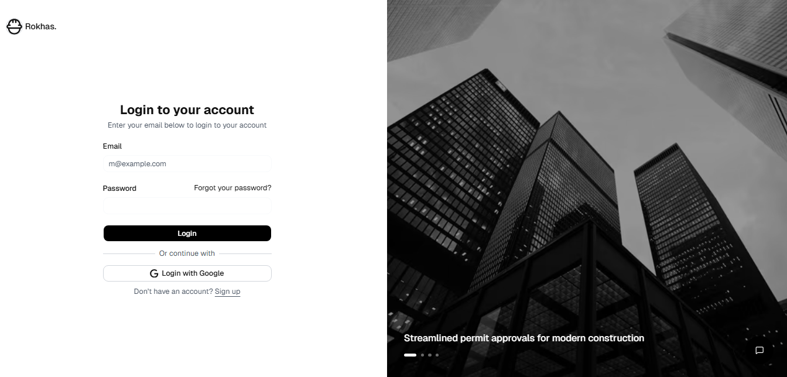
*Secure access with email and password authentication, supporting multiple user roles.*
 
### Account Creation
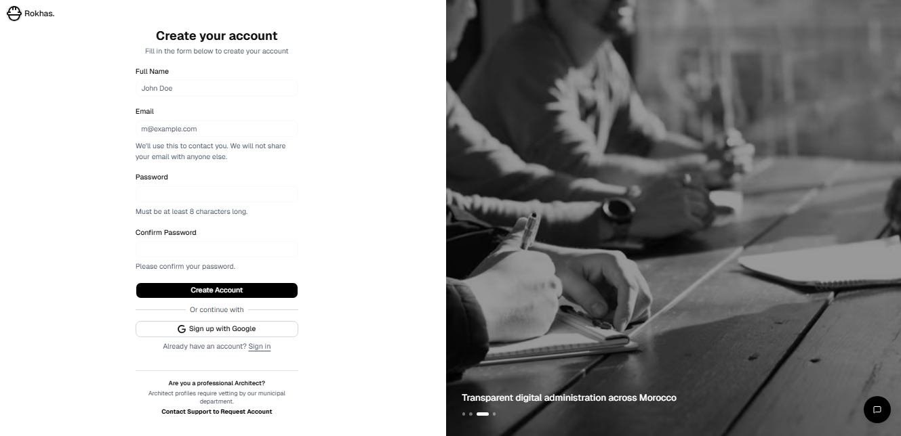
*Simple account creation flow with role selection for Citizens, Architects, and Professionals.*
 
### Profile Management
- **Citizen Profile** — Lightweight account for individuals seeking construction permits
  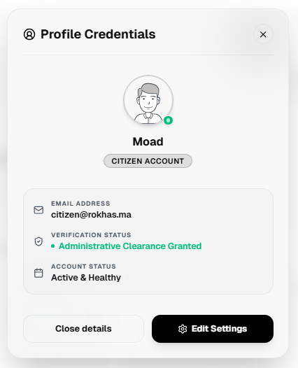
- **Authority Profile** — Administrative account with verification status and clearance details
  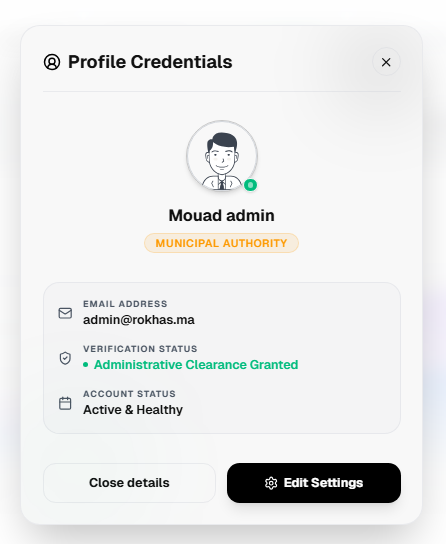
---
 
## Landing Page & Ecosystem
 
### Hero Section
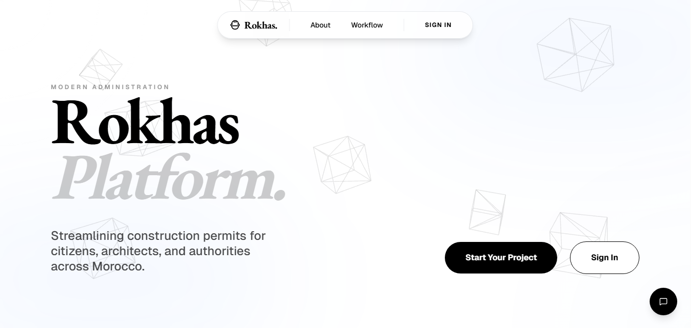
*Modern landing page introducing Rokhas with clear call-to-action buttons.*
 
### Unified Ecosystem
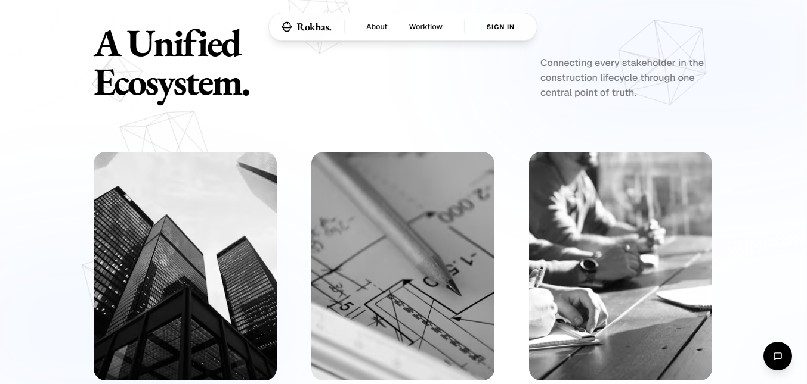
*Visual representation of the three stakeholder groups: Citizens, Architects, and Authorities.*
 
### Simplified Workflow
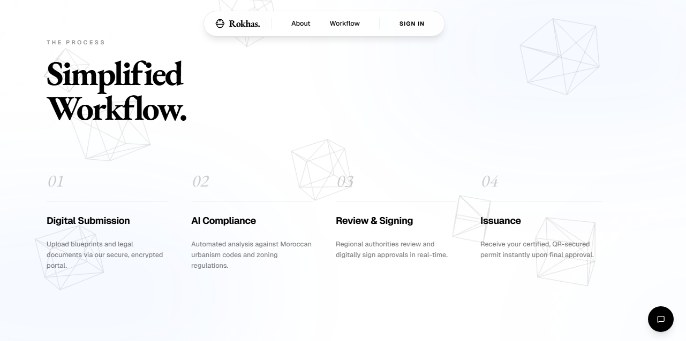
*4-step process: Digital Submission → AI Compliance → Review & Signing → Issuance*
 
---
 
## Dashboards & User Interfaces
 
### Citizen Dashboard
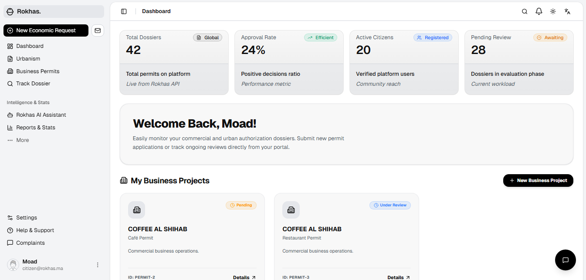
**Features:**
- Real-time dossier tracking and status updates
- My Submissions overview with approval metrics
- Quick access to Rokhas AI Assistant
- Personal project management
### Architect Dashboard
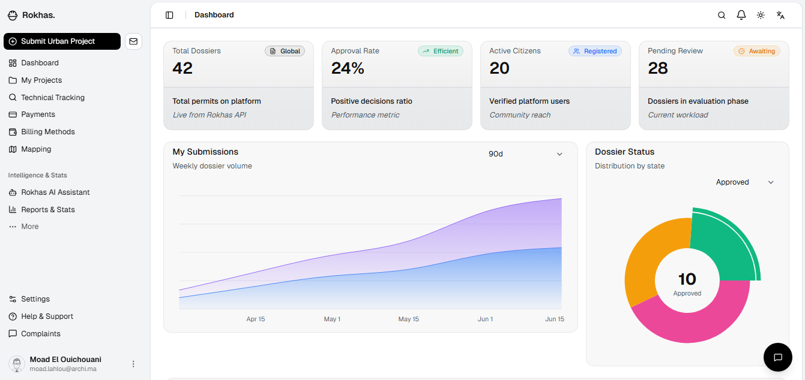
**Features:**
- Urban project submission with integrated forms
- Technical tracking of submitted plans
- Managed payment methods and billing
- Compliance status monitoring
### Authority Dashboard
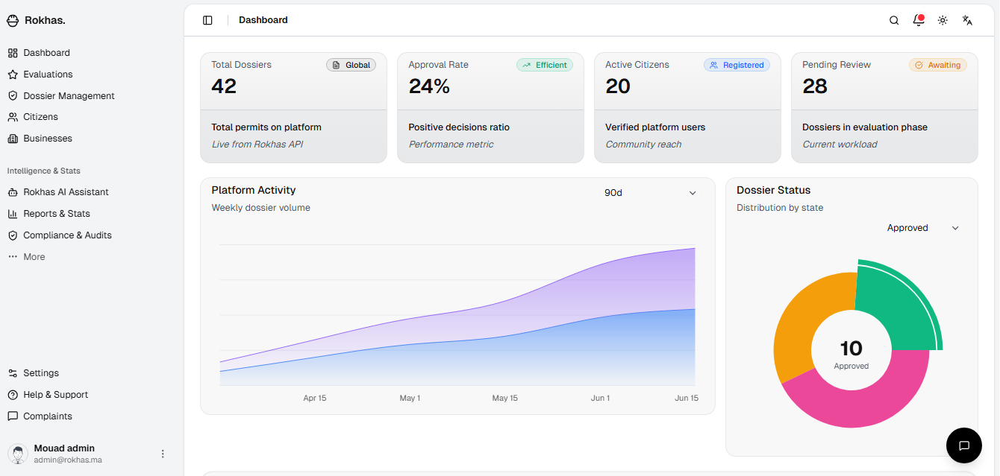
**Features:**
- Global metrics: Total Dossiers, Approval Rate, Active Citizens, Pending Reviews
- Platform Activity trends with weekly dossier volumes
- Dossier Status distribution (pie chart)
- Real-time performance indicators
---
 
## Core Features
 
### 1. Intelligent AI Assistant — Rokhas Agent
 
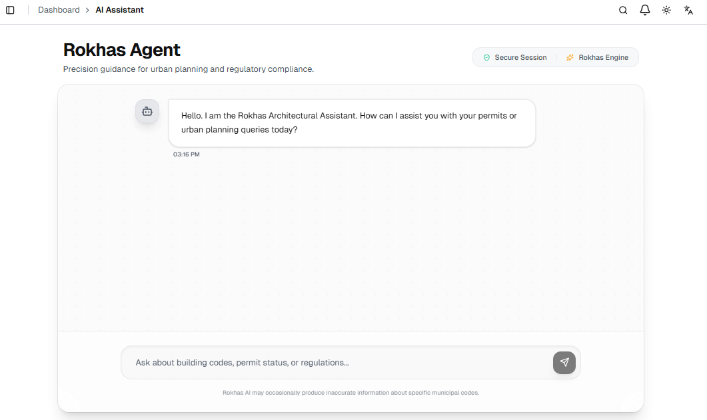
 
The **Rokhas Agent** is an AI-powered assistant that provides:
- **Real-time Guidance** — Answer questions about Moroccan building codes, permit requirements, and regulations
- **24/7 Availability** — Accessible to both registered users and public visitors
- **Regulatory Compliance** — All responses cite relevant RGC articles and legal references
- **Multilingual Support** — Available in French and Arabic
**Example interaction:**
- **Citizen**: "What is the maximum height for a villa in zone R2?"
- **Agent**: "According to RGC Article 15, the maximum height in zone R2 is 8.5 meters. Your project must also respect a minimum setback of 3 meters from the public road (RGC Art. 24) and ground coverage of max 60%."
### 2. Smart Dossier Submission
 
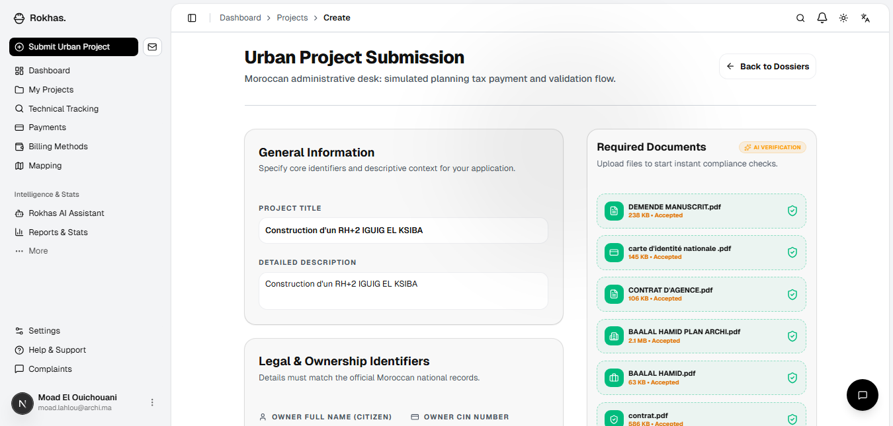
 
**Streamlined submission process:**
- Project General Information — Title, description, and location details
- Required Documents — Automated compliance checking with visual upload indicators
- Legal & Ownership Identifiers — CIN, owner name, and land reference extraction
- Document Preview — Live viewer for submitted PDFs
- Instant Validation — Real-time feedback on missing or incomplete documents
**Automatic Analysis:**
The system automatically extracts critical information from submitted files:
- Citizen CIN (National ID)
- Land Reference (Titre Foncier)
- Property Owner Name
- Plot Surface Area
- Document Status
### 3. AI Compliance Audit
 
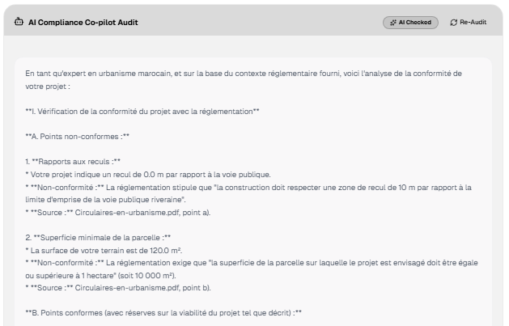
 
**Automatic RGC Verification:**
The Rokhas Agent performs comprehensive conformity analysis:
 
```
 CONFORMITY POINTS:
- Setback 0.0m from public road ✓
- Surface minimum per parcel ✓
 
 NON-CONFORMITIES DETECTED:
- Construction must respect a 10m setback from public road (per municipal regulation)
- Minimum parcel surface requirement (RGC Article 32)
 
 REGULATORY CITATIONS:
- Source: Circulaires en-urbanisme.pdf
```
 
Each non-conformity is flagged with specific RGC article references for instructors to review.
 
### 4. Authority Review Panel
 
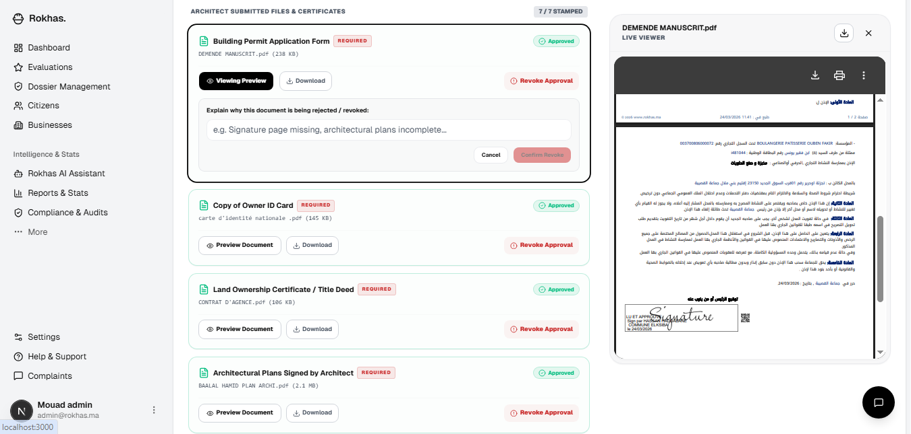
 
**For Municipal Instructors:**
- Document preview and status tracking
- Approval/Rejection decision with detailed reasoning
- Integration with automatic AI compliance reports
- Document validation workflow (REQUIRED → Approved/Revoke Approval)
---
 
## Construction Permit Example
 
### Official Permit Issuance
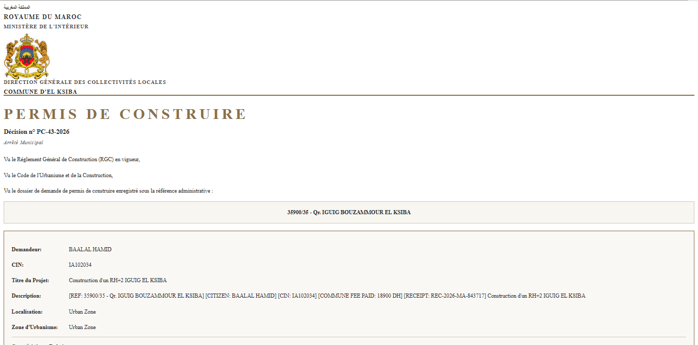
 
**Real-world example of an issued permit:**
 
| Field | Details |
|---|---|
| Decision | PC-43-2026 |
| Applicant | BAAL AL HAMID (CIN: IA102034) |
| Project | Construction d'un RH-2 IGUIG EL KSIBA |
| Location | Urban Zone, El Ksiba |
| Reference | 3590/35 - Qu IGUIG BOUZAMMOUR EL KSIBA |
| Municipality Fee Paid | 18900 DH |
 
---
 
## AI-Powered RAG Architecture
 
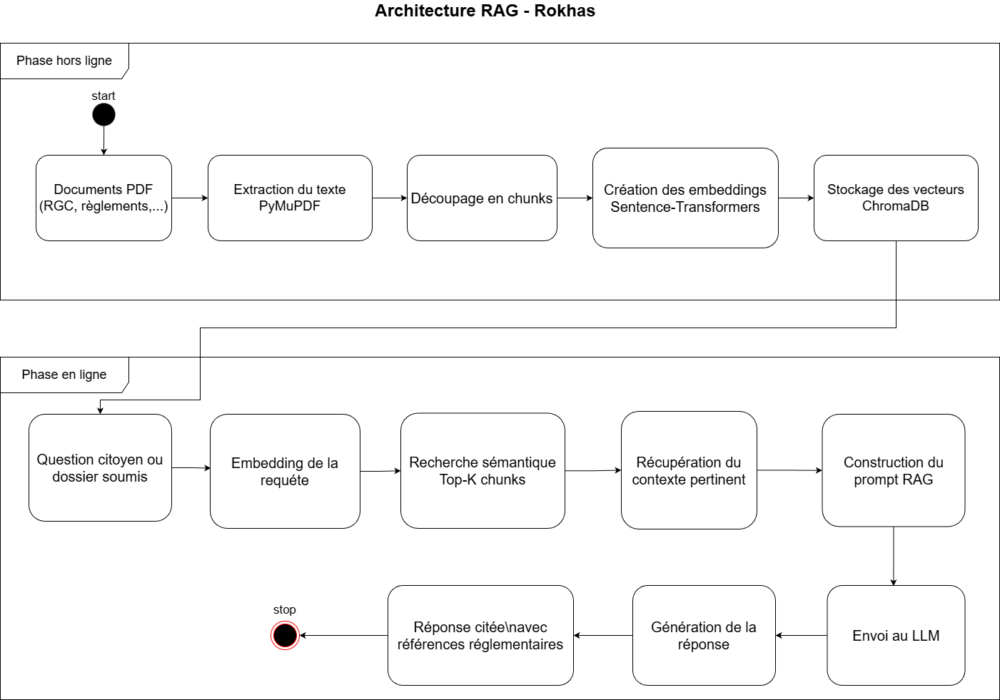
 
### How the Intelligent System Works
 
**Offline Phase:**
1. **PDF Documents** → RGC, Laws, Municipal Plans
2. **Text Extraction** → PyMuPDF processing
3. **Intelligent Chunking** → Semantic segmentation by Article
4. **Vectorization** → Sentence-Transformers (multilingual)
5. **Storage** → ChromaDB vector database
**Online Phase:**
1. **Citizen Question/Dossier Submission**
2. **Query Embedding** → Convert to semantic vector
3. **Semantic Search** → Find Top-K relevant regulations
4. **Context Retrieval** → Prepare regulatory framework
5. **RAG Construction** → Build contextual prompt
6. **LLM Generation** → Generate cited response
7. **Response to Citizen** → With regulatory references
---
 
## Analytics & Reporting
 
### Platform Analytics Dashboard
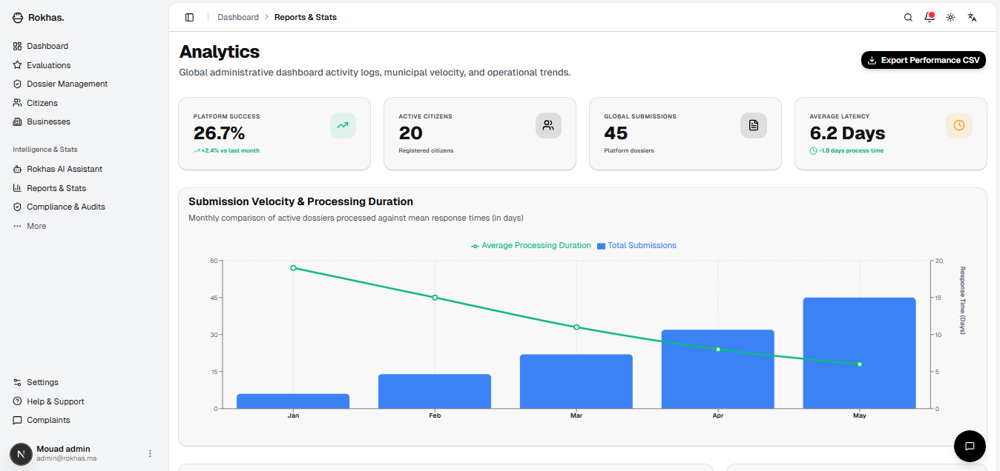
 
**Key Metrics:**
- **Platform Success Rate** — 26.7% (↑2.4% vs last month)
- **Active Citizens** — 20 registered users
- **Global Submissions** — 45 total dossiers
- **Average Latency** — 6.2 days processing time
**Submission Velocity & Processing Duration:**
- Monthly trend analysis
- Comparison of submission volumes vs average response times
- Data-driven insights for municipal planning
---
 
## Tech Stack
 
| Component | Technology |
|---|---|
| **Frontend** | Next.js 14 (App Router), TypeScript, Tailwind CSS, shadcn/ui |
| **Backend** | FastAPI, Python 3.11+, SQLAlchemy, Pydantic |
| **AI Agent** | LangChain, Anthropic Claude, Ollama (local fallback) |
| **Vector DB** | ChromaDB, Sentence-Transformers |
| **Database** | PostgreSQL, Redis (caching) |
| **Deployment** | Docker, Cloud-ready |
 
---
 
## Key Benefits
 
### For Citizens
**24/7 AI Guidance** — Get instant answers to urbanisme questions anytime  
**Transparent Process** — Real-time tracking of permit status  
**Reduced Delays** — Automated compliance checks before submission  
**Easy Submission** — Intuitive forms with document validation  
 
### For Architects
**Instant Feedback** — Know if designs comply before formal submission  
**Professional Dashboard** — Manage multiple projects efficiently  
**Document Portal** — Centralized repository for all project files  
**Clear Standards** — Explicit RGC requirements for each project type  
 
### For Municipal Authorities
**Reduced Workload** — AI handles 80% of compliance verification  
**Faster Decisions** — Pre-filtered, pre-verified dossiers  
**Audit Trail** — Complete transparency and documentation  
**Better Analytics** — Data-driven insights on permit processing  
 
---
 
## Security & Privacy
 
- **JWT Authentication** — Secure token-based access control
- **Role-Based Access Control (RBAC)** — Different permissions per user type
- **Data Encryption** — End-to-end encrypted document uploads
- **Compliance** — Full GDPR & Moroccan data protection compliance
- **Audit Logging** — Complete history of all administrative actions
---
 
## Deployment & Availability
 
**Live Deployment:**
- Frontend: `http://localhost:3000` (development)
- API Documentation: `http://localhost:8000/docs` (Swagger UI)
- AI Agent: Integrated with multi-provider fallback
**Scalability:**
- Containerized with Docker
- Load-balanced API endpoints
- Distributed vector search with ChromaDB
- Redis caching for frequently accessed regulations
 
---

## Installation & Setup.

### Prerequisites
- Node.js 20+
- Python 3.11+
- Git

### 1. Clone & Setup
```bash
git clone https://github.com/pluto-hyp/Rokhas.git
cd Rokhas
```

### 2. Frontend Setup (Next.js)
```bash
cd frontend
pnpm install
pnpm dev
```
*Open http://localhost:3000*

### 3. Backend Setup (FastAPI)
```bash
cd backend
# Create and activate venv
python -m venv venv
.\venv\Scripts\activate
# Install dependencies
pip install -r requirements.txt
# Seed the database with realistic data
python scripts/seed_db.py
# Start the server
python -m uvicorn app.main:app --reload
```
*Open http://localhost:8000/docs to verify the API.*

## Project Structure.

### Backend Structure
```bash
backend/
├── app/
│   ├── main.py                  # FastAPI instance
│   ├── models/                  # SQLAlchemy Models (User, Dossier, Business, Evaluation)
│   ├── schemas/                 # Pydantic Schemas
│   ├── crud/                    # Database Operations
│   ├── api/v1/                  # API Routers (Citizens, Businesses, Reports, etc.)
│   └── services/                # Business Logic & Agent Integration
├── scripts/
│   └── seed_db.py               # Database seeding utility
└── venv/                        # Virtual Environment
```
---
 
## Future Roadmap
 
- **Vision Analysis** — Automatic OCR and diagram analysis from submitted scans
- **Mobile Apps** — Native iOS/Android applications for citizens
- **Regional Expansion** — Deploy across Béni Mellal-Khénifra region
- **National Integration** — Connect with central Rokhas platform
- **Specialized Legal Model** — Fine-tuned LLM for Moroccan urbanism law

## License.
This project is licensed under the **MIT License — see the LICENSE file for details**.

---

<div align="center">

**Made with ❤️ for modern digital administration**

⭐ Star the repo if you like the project!

Any questions or feedback? Feel free to [open an issue](https://github.com/pluto-hyp/Rokhas/issues) or reach out.

</div>
